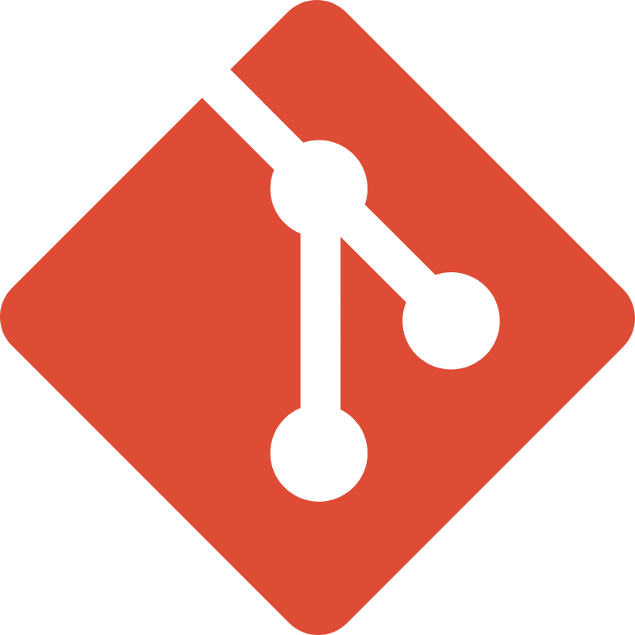

# Инструкция по работе с Git 

Добро пожаловать! 👋  
Этот проект — **практическое руководство** по основным командам и приёмам работы с Git.  
Он написан в формате сети связанных Markdown-файлов и может использоваться как мини-учебник.

---

## 🚀 Что вы изучите
- Установку и настройку Git
- Создание и клонирование репозиториев
- Основные команды (`status`, `add`, `commit`, `log`, `branch`, `merge`)
- Работа с удалёнными репозиториями (GitHub)
- Игнорирование файлов через `.gitignore`
- Полезные советы и примеры

---

## 📖 Содержание
- [Что такое Git](intro.md)
- [Установка Git](install.md)
- [Первичная настройка](config.md)
- [Создание репозитория](init.md) | [Клонирование](clone.md)
- [Проверка статуса](status.md), [Добавление файлов](add.md), [Фиксация изменений](commit.md), [История](log.md)
- [Ветки](branch.md), [Слияние](merge.md)
- [Отправка](push.md), [Получение](pull.md), [Удалённые](remote.md)
- [Игнорирование файлов](gitignore.md)
- [Примеры](examples.md), [Советы](tips.md)

---
